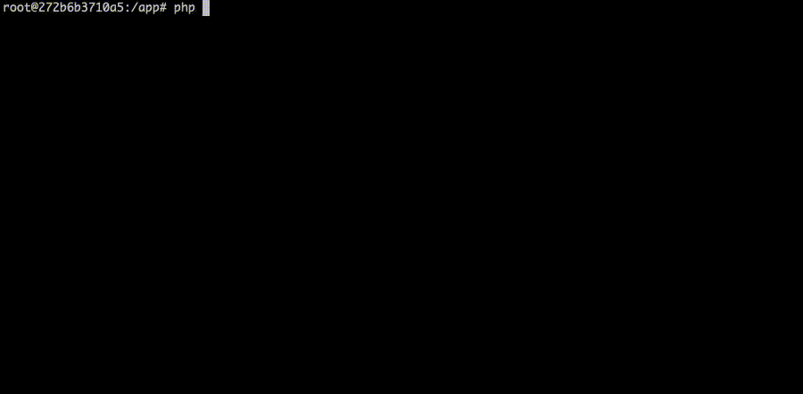

# miisieq/thumbnail-generator

This project uses [GD extension](https://www.php.net/manual/en/book.image.php) to generate a thumbnail from a source image with a maximum dimension specified by user.

You can use following save adapters:
* Local file system
* S3 Bucket
* Dropbox



## Installation
**Caution!** This flow is not optimized for a production usage. For development purposes only.
### 1. Create .env file based on .env.dist example
```bash
$ cp .env.dist .env
```

### 2. Build the Docker image
```bash
$ make build
```

### 3. Install project dependencies
```bash
$ make install
```

### 4. Run the script
```bash
$ make run
```